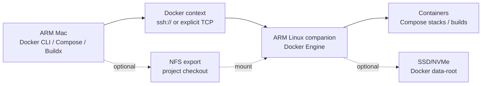

# Architecture

This setup treats the Mac as the control plane and the ARM Linux companion as the Docker data plane.

## Default Path

1. The Mac connects to the companion over SSH.
2. Docker CLI forwards commands through the Docker context.
3. The Docker daemon runs on the companion.
4. Build and runtime work happens on ARM Linux, avoiding architecture mismatch and local Mac daemon instability.

## Fallback Path

Colima can be installed on the Mac as a local fallback. It is useful when the companion is offline, but it should not be required for normal operation.

## Optional NFS

If the companion needs direct access to a Mac checkout for bind mounts, export that directory from macOS and mount it on the companion. The included watchdog remounts stale NFS mounts after the Mac sleeps or changes network state.

