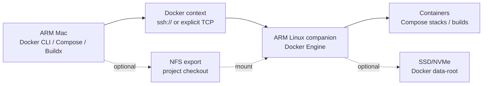

# Architecture

This setup treats the Mac as the control plane and the ARM Linux companion as the Docker data plane.

## Default Path

1. The Mac connects to the companion over SSH.
2. Docker CLI forwards commands through the Docker context.
3. The Docker daemon runs on the companion.
4. Build and runtime work happens on ARM Linux, avoiding architecture mismatch and local Mac daemon instability.

## Fallback Path

Colima can be installed on the Mac as a local fallback. It is useful when the companion is offline, but it should not be required for normal operation.

## Optional Storage Guard

When the companion boots from SD/eMMC but Docker data should live on SSD/NVMe,
the dangerous failure mode is not "Docker down." It is "Docker comes up on the
wrong filesystem because the SSD mount disappeared."

The optional storage guard changes that contract:

- Docker starts only when the expected storage UUID is mounted.
- Docker stops when that storage disappears.
- A reconcile timer keeps retrying until storage returns.
- `docker.socket` is disabled so socket activation cannot revive a bad daemon.
- The reconcile path can mount the storage again when the UUID reappears.

Use it when `COMPANION_DOCKER_DATA_ROOT` should never fall back to rootfs.

For USB-attached storage, `ENABLE_USB_STORAGE_POWER_POLICY=1` installs a
one-shot service plus udev rules that set `usbcore.autosuspend=-1`, force
`power/control=on`, and reapply that state when USB devices change. When a
bridge vendor/product pair is provided, udev also asks systemd to run the
storage reconcile service when that bridge appears, disappears, or changes.

USB SSDs have one more failure mode: after a power event, some bridge chips can
fail USB enumeration before the kernel exposes a disk. When
`ENABLE_USB_STORAGE_RECOVERY_REBOOT=1`, the storage guard watches for that
specific state: expected UUID absent plus recent USB descriptor/enumeration
errors in the kernel journal. It then reboots the companion once per cooldown so
the firmware and USB controller get a clean storage probe. This is deliberately
opt-in because rebooting cannot fix a physically unplugged disk and should not
be the default behavior for every companion.

## Optional NFS

If the companion needs direct access to a Mac checkout for bind mounts, export
that directory from macOS and mount it on the companion.

Two modes are supported:

- `automount`: the original `x-systemd.automount` plus watchdog model
- `direct`: a direct NFS mount plus reconcile timer for hosts where automount
  state wedges after Mac sleep, board restart, or stale network recovery
